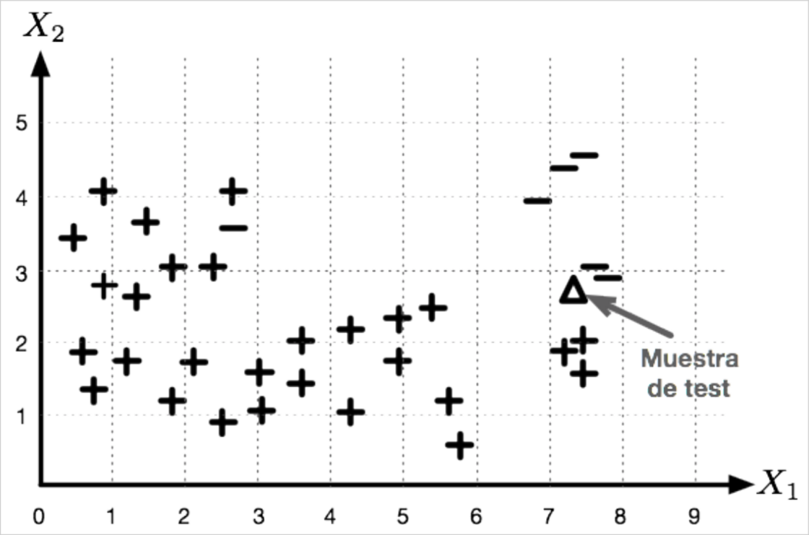

## Teoría Moderna de la Detección y Estimación

# Examen Final Ordinario

*Curso Académico 2023-2024*  

---

## Problema 1

Sean $X_1$ y $X_2$ dos variables aleatorias independientes. $X_1$ sigue una
distribución exponencial unilateral:

$$
p_{X_1}(x_1) = \frac{1}{θ} \exp\left( −\frac{x_1}{θ} \right) \quad 0 ≤ x_1 < ∞
$$

donde $θ > 0$ es un parámetro determinista de valor desconocido, mientras que
$X_2$ sigue una distribución uniforme en el intervalo $[0, θ]$, representando
$θ$ el mismo parámetro en ambas distribuciones.

Para estimar el valor de θ, se propone el siguiente estimador:

$$
\hat{θ} = aX_1 + bX_2
$$

donde $a$ y $b$ son dos constantes.

* a) Determine la esperanza matemática (valor medio) y varianza de la variable
  aleatoria $X_1$.
* b) Determine la esperanza matemática (valor medio) y varianza de la variable
  aleatoria $X_2$.
* c) ¿Es el estimador $\hat{θ}$ insesgado? Justifique su respuesta.
* d) Calcule la varianza del estimador $\hat{θ}$.
* e) Obtenga el valor de la constante $b$, en función de $a$, que hace que el
  estimador $\hat{θ}$ sea insesgado. Reescriba la expresión del estimador
  $\hat{θ}$ para que dependa sólo de la constante $a$.
* f) Determine el valor de $a$, tal que el estimador obtenido en el apartado
  anterior tenga la menor varianza posible. ¿Cuál sería, por tanto, la expresión
  del estimador $\hat{θ}$ insesgado de mínima varianza?

## Problema 2

Un sistema de vigilancia se encarga de detectar intrusos en un edificio. Se
considera el siguiente par de hipótesis:

* $H = 0$: no hay intruso
* $H = 1$: hay un intruso presente

El sistema envía un mensaje de alarma si se acepta la hipótesis $H = 1$. Suponga
que después de procesar los datos, se obtiene $P(1|x) = 0.05$. Asumiendo que el
coste de no detectar un intruso cuando sí lo hay es 10 veces el coste de decidir
que hay intruso cuando no es cierto, ¿debería el sistema enviar un mensaje de
alarma (es decir, aceptar la hipótesis $H = 1$)? Justifique su respuesta.

Nota: para la resolución del problema, considere que el coste de acierto
asociado a cada hipótesis es nulo.

## Problema 3

Sabiendo que $N$ es una variable aleatoria cuya función de densidad de
probabilidad es una gaussiana de media 0 y varianza 1:

p_N(n) = G(n|0,1)

Considere el par de hipótesis:

$$
\begin{aligned}
    H = 0&: &&X = \sqrt{2}N \\
    H = 1&: &&X = 1 + N
\end{aligned}
$$

* a) Determine $p_{X|H}(x|0)$ y $p_{X|H}(x|1)$. Represente, en la misma gráfica,
  ambas verosimilitudes.
* b) Obtenga el clasificador ML basado en $X$.
* c) Calcule la probabilidad de falsa alarma del clasificador ML. Exprese esta
  probabilidad utilizando la función:

    $$
    F(x) = ∫_{-∞}^x \frac{1}{\sqrt{2π}} \exp\left(-\frac{t^2}{2}\right) dt
    $$

## Problema 4

Suponga que se dispone del siguiente conjunto de datos de entramiento en el que
se incluyen muestras de la clase positiva ($+$) y muestras de la clase negativa
($−$), así como una muestra de test ($△$).

Todas las muestras se proyectan en un espacio vectorial de 2 características
($X_1$ y $X_2$). Suponiendo que se utiliza el algoritmo de clasificación $k$-NN
ponderado, responda a las siguientes preguntas:

* a) ¿Cuál sería la clase asignada para la muestra de test si $k = 1$? Razone su
  respuesta.
* b) Para este conjunto de datos de entrenamiento, ¿recomendaría utilizar $k =
  11$? Razone su respuesta.

## Problema 5

Razone si la siguiente afirmación es cierta o falsa:

> *“Para el regresor Lasso, si el parámetro de regularización es cero, la función
> de pérdida que se minimiza para obtener los coeficientes es la suma de los
> cuadrados de los errores entre los valores reales de las etiquetas y los
> valores predichos”*.

En caso de ser falsa, haga la(s) correccione(s) necesaria(s) para que la
afirmación sea cierta.

## Problema 6
Responda brevemente a las siguientes preguntas:

### Pregunta.1
¿Es el filtro de Wiener un filtro lineal? Justifique su respuesta.

### Pregunta.2
¿Qué es un filtro adaptativo? Indique un ejemplo de tipo de algoritmo que se usa
en filtros adaptativos para encontrar los coeficientes del mismo.
